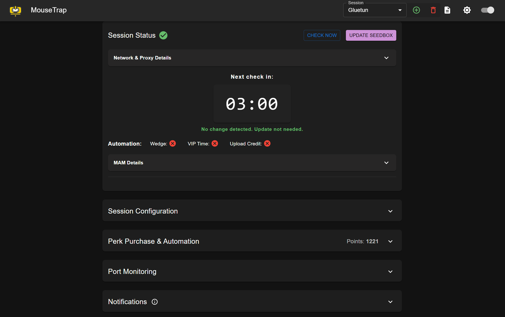

# MouseTrap

_A beginner-friendly Docker web app for automating MyAnonaMouse seedbox and account management._

<p align="center">
  
</p>



---

## 🚀 Quick Start

**1. Create a `docker-compose.yml` file:**

```yaml
services:
  mousetrap:
    image: ghcr.io/sirjmann92/mousetrap:latest
    container_name: mousetrap
    environment:
      - TZ=Europe/London # Your timezone
      - PUID=1000        # Your host user ID  
      - PGID=1000        # Your host group ID
    volumes:
      - ./config:/config # Persistent settings
      - ./logs:/app/logs # Logs for troubleshooting
    ports:
      - 39842:39842
```

**2. Start MouseTrap:**
```bash
docker-compose up -d
```

**3. Configure:** Visit [http://localhost:39842](http://localhost:39842)

---

## 🛠️ Features

- **Web UI**: Modern interface for all automation and configuration
- **Multi-session**: Manage multiple MAM accounts in one instance
- **Automation**: Auto-purchase wedges, VIP, upload credit with smart triggers
- **Notifications**: Email, webhook, Discord integration with event filtering
- **Proxy support**: Global proxy management with testing and IP detection
- **Port monitoring**: Monitor container ports, auto-restart with stack support
- **IP/ASN detection**: Automatic updates with robust fallback chains
- **Event logging**: Comprehensive logging with UI filtering and search
- **VPN integration**: Native networking or HTTP proxy modes

---

## 📋 Environment Variables

| Variable        | Description                              | Default | Example/Notes             |
|-----------------|------------------------------------------|---------|---------------------------|
| `TZ`            | Timezone for logs and scheduling         | UTC     | `Europe/London`           |
| `PUID`          | User ID for volume permissions           | 1000    | Match your host user      |
| `PGID`          | Group ID for volume permissions          | 1000    | Match your host group     |
| `DOCKER_GID`    | Docker group GID for port monitoring     | 992     | See troubleshooting guide |
| `IPINFO_TOKEN`  | ipinfo.io API token (recommended)        | None    | Improves IP detection     |
| `IPDATA_API_KEY`| ipdata.co API key (optional)             | test    | 1,500 requests/day free   |
| `LOGLEVEL`      | Backend log level                        | INFO    | DEBUG, INFO, WARNING      |

> **Note:** For port monitoring, add `-/var/run/docker.sock:/var/run/docker.sock:ro` to volumes

---

## Using an ipinfo.io API Token (Recommended)

ipinfo.io offers a free API token with generous limits for non-commercial use. Using a token increases reliability and reduces the chance of hitting rate limits.

1. Sign up for a free account at [ipinfo.io/signup](https://ipinfo.io/signup).
2. Copy your API token from the dashboard.
3. Set the token as an environment variable in your Docker Compose file or host:

   ```yaml
   environment:
     - IPINFO_TOKEN=your_token_here
   ```

If you do not set a token, MouseTrap will still work, but may fall back to other providers more often.

---

## Testing IP/ASN Changes

1. Change the session's `IP Address` in the UI or `mam_ip` in session-LABEL.yaml.
2. Save and use "Update Seedbox" or wait for the next scheduled check.
3. The backend will update MAM if the IP/ASN is different and log the result.
4. For ASN changes, use an IP from a different provider (VPN/proxy).

---

## 📝 Configuration & Data

- All settings and state are stored in `/config` (if mapped as a volume)
- Each session: `config/session-*.yaml` (created via the UI)
- Port Monitoring: `/config/port_monitoring_stacks.yaml` (auto-created/updated)
- Logs: `/logs` (persisted outside the container)
- Global options: `config/config.yaml` (auto-created/updated)

---


## � Optional Features

### Port Monitoring
Add Docker socket access to enable container port monitoring:

```yaml
volumes:
  - ./config:/config
  - ./logs:/app/logs
  - /var/run/docker.sock:/var/run/docker.sock:ro  # Add this line
```

If your Docker group GID isn't 992:
```bash
# Find your Docker group GID
getent group docker
# Output: docker:x:281:

# Set in docker-compose.yml
environment:
  - DOCKER_GID=281  # Use your actual GID
```

### Enhanced IP Detection
Get a free API token from [ipinfo.io](https://ipinfo.io/) for more reliable IP detection:

```yaml
environment:
  - IPINFO_TOKEN=your_token_here
```

#### IP Lookup Fallback Chain
MouseTrap uses multiple IP lookup providers for maximum reliability:

| **Provider** | **Protocol** | **Data** | **Rate Limits** | **Notes** |
|--------------|--------------|----------|-----------------|-----------|
| **ipinfo.io** | HTTPS | IP, ASN, Geo | High w/token | Primary choice - get free token |
| **ipdata.co** | HTTPS | IP, ASN, Geo | 1,500/day (free) | Get free API key - better than test key |
| **ip-api.com** | HTTP | IP, ASN, Geo | None | May timeout through proxies |
| **ipify.org** | HTTPS | IP only | None | Final fallback - prevents total failure |

> **Recommendations:** 
> - Get a free [ipinfo.io token](https://ipinfo.io/signup) for best reliability and higher rate limits
> - Get a free [ipdata.co API key](https://ipdata.co/pricing.html) for 1,500 daily requests (eliminates HTTP 401 errors)

**Optional Environment Variables:**
```yaml
environment:
  - IPINFO_TOKEN=your_ipinfo_token_here
  - IPDATA_API_KEY=your_ipdata_api_key_here
```

---

## 🌐 VPN Integration

### Option 1: Shared Network (Simple)
```yaml
services:
  gluetun:
    image: qmcgaw/gluetun
    ports:
      - 39842:39842  # Expose MouseTrap through VPN
    # ... VPN configuration

  mousetrap:
    image: ghcr.io/sirjmann92/mousetrap:latest
    network_mode: "service:gluetun"  # Share VPN network
    # ... other config (no ports section needed)
```

### Option 2: HTTP Proxy (Recommended)
```yaml
services:
  gluetun:
    image: qmcgaw/gluetun
    environment:
      - HTTPPROXY=on  # Enable HTTP proxy
    ports:
      - 8888:8888     # HTTP proxy port
    # ... VPN configuration

  mousetrap:
    image: ghcr.io/sirjmann92/mousetrap:latest
    ports:
      - 39842:39842   # Direct access
    # Configure proxy in MouseTrap UI: gluetun:8888
```

---

## 📚 Documentation

- **[Features Guide](docs/features-guide.md)**: Comprehensive feature overview and usage
- **[API Reference](docs/api-reference.md)**: Complete REST API documentation  
- **[Troubleshooting](docs/troubleshooting.md)**: Common issues and solutions
- **[Architecture & Rules](docs/architecture-and-rules.md)**: Technical implementation details
- **[Purchase Rules](docs/purchase_rules.md)**: Automation logic and guardrails

---

## 🆘 Quick Troubleshooting

**Can't access UI?** Check port mapping and firewall settings  
**Docker permissions error?** Mount Docker socket and set correct DOCKER_GID  
**Automation not working?** Verify only one session per MAM user has automation enabled  
**Proxy issues?** Use the proxy test feature before assigning to sessions

For detailed troubleshooting: **[docs/troubleshooting.md](docs/troubleshooting.md)**

---

## 💬 Support

- **Issues**: [GitHub Issues](https://github.com/sirjmann92/mousetrap/issues)
- **Documentation**: Check the `docs/` directory for detailed guides  
- **Logs**: Enable `LOGLEVEL=DEBUG` and check container logs for troubleshooting

---
## 🆘 Troubleshooting

- **Error: `no configuration file provided: not found`**
  - Make sure you have a valid `docker-compose.yml` before running Docker commands.
- **Can't access UI?**
  - Confirm port 39842 is exposed and not blocked by firewall.
- **Proxy/VPN issues?**
  - Ensure containers are on the same Docker network.
  - Use VPN's Docker container IP or name for proxy host.
  - You can inspect Docker networks with `docker network ls` and `docker network inspect <network>`.
- **Permissions:**
  - Set `PUID`/`PGID` to match your user for config/logs volume access.
- **Port Monitoring not working?**
  - Mount `/var/run/docker.sock:/var/run/docker.sock:ro` to enable. Otherwise, feature is disabled.
  - If your Docker group GID is not 992, set the `DOCKER_GID` environment variable as described above.
- **Session not updating?**
  - Check backend logs and UI event log for errors. Confirm entered IP is correct.

---

## 🧑‍💻 Advanced Options

### Build from Source

If you want to build your own image:

```bash
git clone https://github.com/sirjmann92/mousetrap.git
cd mousetrap
# In your docker-compose.yml, use 'build: .' instead of 'image:...'
docker-compose up --build -d
```

---

## VPN Integration

MouseTrap can connect to MyAnonaMouse via your VPN container in two ways:

### 1. Native Networking (Docker Compose network)
- Place MouseTrap and your VPN container (e.g., Gluetun, binhex/arch-delugevpn) on the same Docker network.
- Set the `mam_ip` in your session config (`IP Address` in the UI) to the VPN's external IP.
- All MAM API calls will go out via the VPN container if you set the `network_mode` in Compose:

```yaml
services:
  mousetrap:
    image: your/mousetrap
    network_mode: "service:gluetun"  # or your VPN container name
    ...
```


### 2. Proxy Configuration (Recommended for multi-session/multi-IP)

MouseTrap supports global proxy management and instant proxy testing:

- **Add, edit, or delete proxies** in the Proxy Configuration card. Proxies are stored globally and can be reused across sessions.
- **Test proxies instantly**: When you select a proxy in the Session Configuration card, MouseTrap will immediately test the connection and display the detected public IP (the IP that MAM will see).
- **Use the detected proxied IP**: Click the "USE PROXY IP" button to instantly fill the session's IP field with the tested public IP for the selected proxy.
- **Supports authentication**: Enter host, port, username, and password as needed.
- **Proxy details are stored in `/config/proxies.yaml`** and are not tied to any single session.
- **Session configs reference proxies by label** for easy switching and management.

#### Example: Gluetun HTTP Proxy
- Enable HTTP proxy in Gluetun: [Gluetun HTTP Proxy Docs](https://github.com/qdm12/gluetun-wiki/blob/main/setup/http-proxy.md)
- Add a proxy in MouseTrap with host, port, and (if set) your proxy username/password.
- Select the proxy in your session config and use the "USE PROXY IP" button to set the correct public IP.

#### More Info
- [qmcgaw/gluetun HTTP Proxy](https://github.com/qdm12/gluetun-wiki/blob/main/setup/http-proxy.md)

---

## Session Management & Event Logging

- Each session in MouseTrap is independent: you can set a different MAM id, IP, and automation settings per session, and select any configured proxy from the global proxy list.
- Session configs are stored in `/config/session-*.yaml` and reference proxies by label.
- You can switch between sessions in the UI, and each will use its selected proxy and IP for MAM API calls.
- Event Log Filtering: The event log modal supports filtering by Global events, All Events, or by session label. The dropdown is dynamic and always reflects available sessions and global actions.
- All port monitoring actions (add/delete check, container restart) are also logged globally and filterable in the event log.

---

## Port Monitoring

- The Port Monitoring card is global (not per-session) and allows you to monitor the reachability of Docker container ports.
- All port checks and settings are persisted in `/config/port_monitoring_stacks.yaml`.
- Each check can be configured with its own interval (minimum 1 minute). Status is color-coded (green/yellow/red) based on reachability and last check time.
- If Docker permissions are missing, the UI shows a warning, but the rest of the app remains fully functional.
- All port check actions and container restarts are logged in the UI event log and filterable by label.
- To support "compose stacks" (multiple services in a single Docker Compose script), you can monitor a primary container (e.g. VPN) and define secondary containers. MouseTrap will restart the primvary container and monitor for stability, then it will restart all secondary containers. This allows us to use the Docker Socket to restart an entire group of containers that might be dependent on the primary to restore network connection and stability to the system.

---

## 🏗️ Full Docker Compose Examples

### 1. Native VPN Networking (network_mode)

```yaml
#version: '3.8'
services:
  gluetun:
    image: qmcgaw/gluetun
    container_name: gluetun
    cap_add:
      - NET_ADMIN
    environment:
      - VPN_SERVICE_PROVIDER=protonvpn
      - OPENVPN_USER=youruser
      - OPENVPN_PASSWORD=yourpass
      - TZ=Europe/London
    ports:
      - 39842:39842  # Expose MouseTrap's web UI via VPN container
    volumes:
      - ./gluetun:/gluetun

  mousetrap:
    image: ghcr.io/sirjmann92/mousetrap:latest
    container_name: mousetrap
    network_mode: "service:gluetun"
    environment:
  - TZ=Europe/London
  - PUID=1000
  - PGID=1000
  - DOCKER_GID=281 # (Optional) Set to your host's Docker group GID if not 992
    volumes:
      - ./config:/config
      - ./logs:/app/logs
      - /var/run/docker.sock:/var/run/docker.sock:ro #Optional, for port monitoring support
    # No ports here! All traffic is routed through gluetun
```

- Access the UI at `http://localhost:39842` (traffic is routed through the VPN container).
- Do NOT set a `PORT` environment variable—MouseTrap always runs on 39842.


### 2. HTTP Proxy Mode (recommended for multi-session)

```yaml
#version: '3.8'
services:
  gluetun:
    image: qmcgaw/gluetun
    container_name: gluetun
    cap_add:
      - NET_ADMIN
    environment:
      - VPN_SERVICE_PROVIDER=protonvpn
      - OPENVPN_USER=youruser
      - OPENVPN_PASSWORD=yourpass
      - TZ=Europe/London
      - HTTPPROXY=on
      - HTTPPROXY_USER=proxyuser
      - HTTPPROXY_PASSWORD=proxypass
    ports:
      - 8888:8888  # HTTP proxy
    volumes:
      - ./gluetun:/gluetun

  mousetrap:
    image: ghcr.io/sirjmann92/mousetrap:latest
    container_name: mousetrap
    environment:
  - TZ=Europe/London
  - PUID=1000
  - PGID=1000
  - DOCKER_GID=281 # (Optional) Set to your host's Docker group GID if not 992
    volumes:
      - ./config:/config
      - ./logs:/app/logs 
      - /var/run/docker.sock:/var/run/docker.sock:ro #Optional, for port monitoring support
    ports:
      - 39842:39842
    depends_on:
      - gluetun
```
### 🐭 Unraid Full Docker Compose Example

For Unraid users, here is a full example `docker-compose.yml` configuration:

```yaml
services:
  mousetrap:
    image: ghcr.io/sirjmann92/mousetrap:latest
    # build: ../src # Uncomment if you want to build from source instead of using the pre-built image
    container_name: Mousetrap
    # network_mode: container:qbittorrent-vpn # Shares network with qbittorrent-vpn for VPN routing
    environment:
      - TZ=America/Chicago
      - PUID=99
      - PGID=100
      - DOCKER_GID=281
      - HOST_OS=Unraid
      - HOST_HOSTNAME=MyHostname
      - HOST_CONTAINERNAME=MouseTrap
#      - LOGLEVEL=INFO # Optional - Set level for troubleshooting
#      - IPINFO_TOKEN=your_token_here # Optional
    volumes:
      - ../config:/config # Persist configs (use absolute if needed, e.g., /mnt/user/appdata/mousetrap/config)
      - ../logs:/app/logs # Persist logs
      - /var/run/docker.sock:/var/run/docker.sock
    restart: unless-stopped
```

Adjust paths and environment variables as needed for your Unraid setup.

**Notes:**
- The `/var/run/docker.sock` mount is only required if you want to enable the Port Monitoring feature. Without it, all other features will work normally.
- The `./logs:/app/logs` volume is recommended to persist logs outside the container. This allows you to view logs even if the container is removed or recreated.
- In HTTP proxy mode, enter your proxy credentials in each session's proxy config in the MouseTrap UI that you want to route through the proxy's connection.
- For other VPN containers see their docs for enabling Privoxy or HTTP proxy and adjust the Compose file accordingly.
- In VPN mode, only the VPN container should expose ports. In non-VPN/proxy mode, expose 39842 on the `mousetrap` service.
- The backend listens on port 39842 by default; you can override this with the `PORT` environment variable in case of conflicts.

---

## Notifications

MouseTrap supports notifications via Email (SMTP) and Webhook (including Discord). Configure these in the Notifications card in the UI.

### Email (SMTP)

- Enter your SMTP server details, username, password, and recipient email in the UI.
- For Gmail, you must use an <b>App Password</b> (not your main password) and enable 2-Step Verification on your account.
- Host: <b>smtp.gmail.com</b>
- Port: <b>587</b> (TLS) or <b>465</b> (SSL)
- See the UI tooltip for a quick Gmail setup guide, or visit:
  - [Create App Password](https://support.google.com/mail/answer/185833?hl=en)
  - [SMTP Setup Instructions](https://support.google.com/a/answer/176600?hl=en)

### Webhook

- Enter your webhook URL in the UI. For Discord, check the "Discord" box to send Discord-compatible messages.
- You can test both Email and Webhook notifications directly from the UI.

### Port Monitor Notifications: Global vs Per-Port

MouseTrap supports two ways to notify you of port check failures:

- **Global Notification Rule:**
  - In the Notifications card, enable "Port Monitor Failure" for global notifications.
  - Any port check failure will trigger a notification via the selected channels (email/webhook/Discord).
  - Use this for a simple, all-or-nothing approach.

---

## Logging & Debugging

MouseTrap uses Python's standard logging with timestamps and log levels (DEBUG, INFO, WARNING, ERROR, CRITICAL).

- **Control log level with the `LOGLEVEL` environment variable.**
- Default is `INFO`. For troubleshooting, set `LOGLEVEL=DEBUG` in your Compose file or environment.
- All backend checks, updates, warnings/errors, and port monitoring actions are also logged to the persistent event log (viewable in the UI and filterable).

### Example: Enable DEBUG Logging in Docker Compose

```yaml
services:
  mousetrap:
    # ...other config...
    environment:
      - LOGLEVEL=DEBUG
      - TZ=Europe/London
      - PUID=1000
      - PGID=1000
    # ...
```


You can use any standard log level: `DEBUG`, `INFO`, `WARNING`, `ERROR`, `CRITICAL`.
Logs will include timestamps, log level, and message for easy troubleshooting.

---

## 📚 More Info

- [docs/CHANGELOG.md](docs/CHANGELOG.md): Recent features & bugfixes
- [docs/architecture-and-rules.md](docs/architecture-and-rules.md): Automation logic & rules
- [docs/purchase_logging_and_event_log.md](docs/purchase_logging_and_event_log.md): Event log details
- [Gluetun HTTP Proxy Setup](https://github.com/qdm12/gluetun-wiki/blob/main/setup/http-proxy.md)

---

## 💬 Support

If you get stuck, check the event log in the UI, review logs in `/logs`, or open an issue.